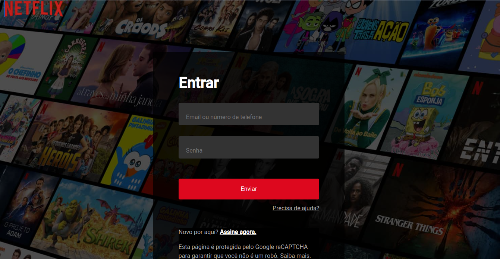
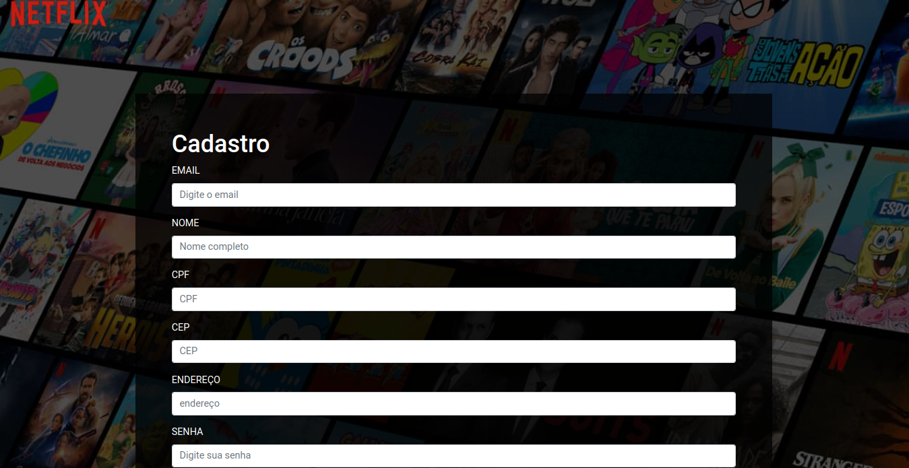
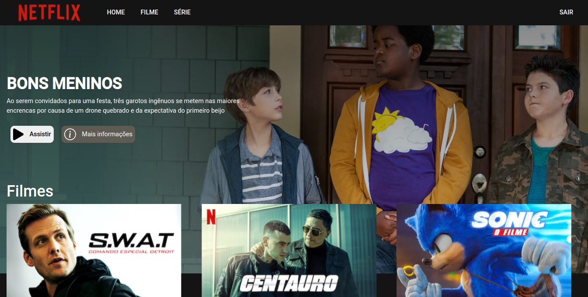
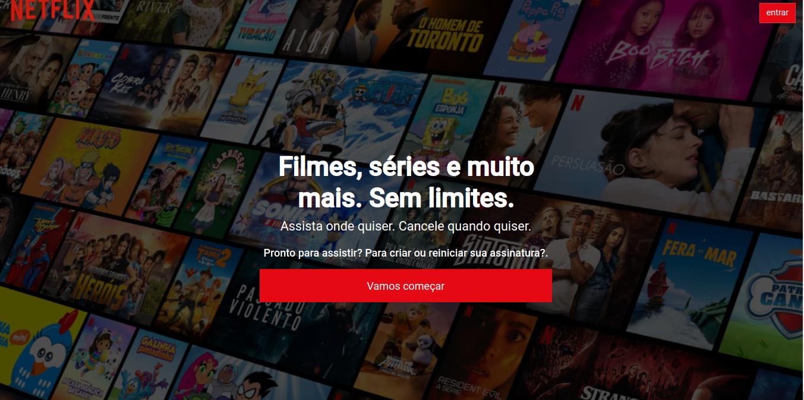

# Clone netflix

Olá, esse projeto uma simples réplica da netflix em React, com sistema de login e registro de usuário, possuindo uma página home acessada quando o usuário está logado em sua conta. Essa página vai possuir um banner, series e filmes, todos sendo buscado da API REST , desenvolvida com express, utilizando como banco de dados o MYSQL.

### - Tela de login

### - Tela de Cadastro de usuário

### - Tela de home

### - Tela index


## Como rodar?

Você precisa ter o [Node](https://nodejs.org/en/), o [Git](https://git-scm.com/) e algum gerenciador de pacotes([NPM](https://docs.npmjs.com/downloading-and-installing-node-js-and-npm/) | [Yarn](https://classic.yarnpkg.com/lang/en/docs/install)) instalados em sua máquina.

```bash
1. Clone o repositório:
$ git clone https://github.com/Gabrielttbr/client-netflix

2. Acesse a pasta e instale as dependências via terminal:
$ yarn / npm install

3. Inicie a aplicação em modo de desenvolvimento:
$ yarn dev / npm run dev

4. O servidor será aberto em http://localhost:3000
```
Após realizar esse passo a passo o seu front-end Estara configurado.Agora vamos configurar o back-end

<p align="center"><a href="https://github.com/Gabrielttbr/api-netflix.git" target="_black">BACK-END</a></p>